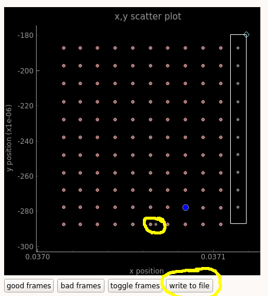

============
Diatom example
============
.. code-block:: bash
    
    ssh -X max-cfel
    git clone https://github.com/andyofmelbourne/speckle-tracking.git
    cd speckle-tracking
    mkdir -p hdf5/diatom
    cp /gpfs/cfel/cxi/scratch/user/amorgan/2018/speckle-data/MLL_260/MLL_260_minimal.cxi hdf5/diatom/
    source /gpfs/cfel/cxi/common/cfelsoft-rh7/setup.sh
    module load cfel-python3/latest
    python gui/speckle-gui.py hdf5/diatom/MLL_260_minimal.cxi

Now you should see a confusing error about some widget not having 'R'. This is because the gui doesn't know where to find the sample translations, which is at: *MLL_260_minimal.cxi:/entry_1/sample_1/geometry/translation*. When you ran the last command above, it automatically created a file called *hdf5/diatom/speckle-gui.ini*, which is copied from the template in *gui/speckle-gui.ini*. Anyway we must edit this new file and change the line from:
.. code-block:: bash
    
    [hdf5/diatom/speckle-gui.ini]
    translation_paths = ['/pos_refine/translation', '/entry_1/sample_3/geometry/translation']

To: 
.. code-block:: bash
    
    [hdf5/diatom/speckle-gui.ini]
    translation_paths = ['/pos_refine/translation', '/entry_1/sample_3/geometry/translation', '/entry_1/sample_1/geometry/translation']

Now rerun the last command, and you should be looking at a window with two tabs. Click on the tab *show / select frames*, drag the verical yellow line to the right, then adjust the colour scale and you should see diffraction data. 

============
Select frames
============

