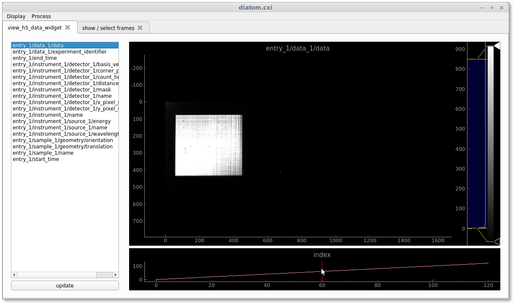

Diatom example
**************

.. contents:: Table of Contents

First download the cxi file (link to come, for now at ~/Documents/2019/speckle-data/diatom_tutorial/diatom.cxi).

The Input CXI File
------------------
The file has the following structure::

     └─ $  h5ls -r diatom.cxi 
    /                        Group
    /entry_1                 Group
    /entry_1/data_1          Group
    /entry_1/data_1/data     Dataset {400, 480, 438}
    /entry_1/instrument_1    Group
    /entry_1/instrument_1/detector_1 Group
    /entry_1/instrument_1/detector_1/basis_vectors Dataset {400, 2, 3}
    /entry_1/instrument_1/detector_1/distance Dataset {SCALAR}
    /entry_1/instrument_1/detector_1/mask Dataset {480, 438}
    /entry_1/instrument_1/detector_1/x_pixel_size Dataset {SCALAR}
    /entry_1/instrument_1/detector_1/y_pixel_size Dataset {SCALAR}
    /entry_1/instrument_1/source_1 Group
    /entry_1/instrument_1/source_1/energy Dataset {SCALAR}
    /entry_1/instrument_1/source_1/wavelength Dataset {SCALAR}
    /entry_1/sample_1        Group
    /entry_1/sample_1/geometry Group
    /entry_1/sample_1/geometry/translation Dataset {400, 3}

This is the minimal amount of information that the input cxi file can have, see :ref:`cxi-file`. So, as we can see in the :code:`entry_1/data_1/data` the dataset consists of 121 frames, where each frame is an image of 516x1556 pixels.

Now that's out of the way, we should decide if we want to use the `Python Interface`_, `Command-line Interface`_ or the `Gui Interface`_. So... choose. 

Python Interface
----------------

Make the mask
    First let's import speckle tracking and things, then call the :py:func:`~speckle_tracking.make_mask` function with default settings to create a binary True/False (good/bad) pixel map for the detector. Then we are going to write this back into the file::

        import speckle_tracking as st
        import h5py
        import numpy as np
        
        # extract data
        with h5py.File('diatom.cxi', 'r') as f:
            data  = f['/entry_1/data_1/data'][()].astype(np.float32)
            basis = f['/entry_1/instrument_1/detector_1/basis_vectors'][()]
            z     = f['/entry_1/instrument_1/detector_1/distance'][()]
            x_pixel_size = f['/entry_1/instrument_1/detector_1/x_pixel_size'][()]
            y_pixel_size = f['/entry_1/instrument_1/detector_1/y_pixel_size'][()]
            wav          = f['/entry_1/instrument_1/source_1/wavelength'][()]
            translations = f['/entry_1/sample_1/geometry/translation'][()]
        
        mask  = st.make_mask(data)
        
        st.write_h5({'mask': mask}, 'diatom.cxi')

    The function :py:func:`~speckle_tracking.write_h5` is a conveniance function for writing a dataset to the group "/speckle_tracking/" inside the h5 file, it will overide any previous dataset.

Generate the Whitefield
    Now we make the "whitefield" which is the image formed on the detector when there is no sample in place. You might already have this from a separate measurement, but usually it's better to estimate it directly from the scan data which we do by calling :py:func:`~speckle_tracking.make_whitefield`::

        W = st.make_whitefield(data, mask)
        
        st.write_h5({'whitefield': W}, 'diatom.cxi')
        
Define the ROI 
    Usually the region of the detector with useful diffraction is small compared to the full detector area. So defining the ROI (Region Of Interest) speeds things up, do this manually or by using a script that tries to guess this region :py:func:`~speckle_tracking.guess_roi`::
        
        roi = st.guess_roi(W)
        good_frames = np.arange(1,data.shape[0])
        
        st.write_h5({'roi': roi, 'good_frames': good_frames}, 'diatom.cxi')
        
        # apply the roi
        s    = (good_frames, slice(roi[0], roi[1]), slice(roi[2], roi[3]))
        data         = data[s]
        W            = W[s[1:]]
        mask         = mask[s[1:]]
        basis        = basis[s[0]]
        translations = translations[s[0]]
        
Determine the defocus
    Now let us estimate the focus to sample distance -- this distance determines the effective magnification of the object reference image in each of the shadow images. There are two methods for achieving this automatically: :py:func:`~speckle_tracking.fit_defocus_registration` and :py:func:`~speckle_tracking.fit_thon_rings`. However in the present case, the defocus distance could be estimated during the experiment::
        
        defocus = 2.23e-3
        
        st.write_h5({'defocus': defocus}, 'diatom.cxi')
        
Generate the pixel space translations
    Now we will determine the relative position of the magnified object in each of the shadow images in pixel units. First, we must decide the sampling frequency for the object reference map. Here we set this to the de-magnified pixel size, as determined by the estimated defocus. Then we call :py:func:`~speckle_tracking.make_pixel_translations`::
        
        dx_ref  = x_pixel_size * defocus / z
        dy_ref  = y_pixel_size * defocus / z
        xy_pix  = st.make_pixel_translations(translations, basis, dx_ref, dy_ref)
        
        st.write_h5({
            'dxy_ref': np.array([dx_ref, dy_ref]),
            'xy_pix' : xy_pix
            }, 'diatom.cxi')

Determine the pixel mapping and object reference image
    At this stage we have everything we need to solve for the object reference map and the wavefront distortions in pixel units using :py:func:`~speckle_tracking.pixel_map_from_data`::

        sw = [10, 10]
        pixel_map, res = st.pixel_map_from_data(data, xy_pix, W, mask, search_window=sw)
        
        st.write_h5({
            'pixel_map': pixel_map,
            'object_map' : res['object_map']
            }, 'diatom.cxi')

Pixel map to ray angles and pupil phase
    Once we have the pixel mapping array, we can convert this to into the ray propagation angles, which can then be integrated to obtain the phase using :py:func:`~speckle_tracking.integrate_pixel_map`::

        phase, angles, res = st.integrate_pixel_map(pixel_map, W, wav, z-defocus, z, x_pixel_size, y_pixel_size, dxy[0], dxy[1], False, maxiter=5000)
        
        st.write_h5({
            'phase': phase,
            'angles' : angles
            }, 'diatom.cxi')

    Armed with the phase, we can obtain many quantities of interest: such as the propagation profile near the focus (:py:func:`~speckle_tracking.propagation_profile`) and the corrected defocus and astigmatism values (:py:func:`~speckle_tracking.get_defocus`).

Command-line Interface
----------------------
In the folder speckle-tracking/speckle_tracking/bin are a list of python functions designed to be called from the command line. You can add them to the path with::
    
    export PATH=/path_to_speckle-tracking/speckle_tracking/bin:$PATH

To make this persistent, then add this line to your .bashrc. 

Apart from the input cxi file, all other options are passed via a text file. This file contains a list of option = value pairs, like so::

    ▶ cat make_mask.ini 
    [make_mask]
    data  = /entry_1/data_1/data ;str, location of diffraction data

    [make_mask-advanced]
    h5_group = speckle_tracking ;str, name of h5 group to write to

The value can be a simple python object (string, float, int, bool, dict, list) or a location in the cxi file (as above for data). The 'make_mask-advanced' section is for options that will likely not be required to change often. By default, each program looks for this configuration file in the current directory and if it is not found there, the default ini file will be called from the same directory as the script. After executing the script, this file will then be copied to the same directory as the cxi file for future reference. One can specify a specific .ini file by using the -c option. For example::

    make_mask.py diatom.cxi
    # or 
    make_mask.py diatom.cxi -c make_mask.ini
        
The steps above, in the `Python Interface`_, can then be performed with the following commands::

    make_mask.py diatom.cxi
    make_whitefield.py diatom.cxi
    guess_roi.py diatom.cxi
    write_h5.py diatom.cxi/speckle_tracking/defocus 2.23e-3
    write_h5.py diatom.cxi/speckle_tracking/good_frames 'range(1,121)'
    pixel_map_from_data.py diatom.cxi

To inspect the results of these commands one can of course look into the datasets produced in diatom.cxi/speckle_tracking using whatever means you please. For quick inspection we also have a convenience function for quickly viewing hdf5 datasets using pyqtgraph::

    hdf_display.py diatom.cxi/speckle_tracking/object_map

Gui Interface
-------------
First be sure that the speckle tracking bin dirctory is in the path::

    export PATH=/path_to_speckle-tracking/speckle_tracking/bin:$PATH

Then fire up the GUI::

    speckle_gui.py diatom.cxi

At this point the file speckle_gui.ini has just been copied from the bin directory to the current directory, which can be edited and then loaded automatically at the next call. Also a window should pop up. On the left you will see the locations of datasets in the cxi file. Clicking on /entry_1/data_1/data will cause the widget to display the raw detector readings. To the right of the window the colour scale can be adjusted, at the bottom the frame number can be changed by draging the vertical yellow line from left to right, in the image panel the image can zoomed in or out with the mouse wheel and translated with click and drag. After some adjustment of the colour scale you should see this:

Select good frames
    Clicking on the show / select frames tab will display a widget designed for frame selection:

    .. image:: images/select_frames.png
       :width: 600

    To the right is a panel that displays the x-y position of the sample as a scatter plot. The blue circle indicates the current frame, the red dots indicate good frames and the grey dots bad frames. By clicking on the small circles frames can be toggled good or bad, or, the rectangle can used to select many frames. Clicking write to file, will output the frame selection to the dataset /frame_selector/good_frames in the diatom.cxi file. Now if you drag the vericle yellow line all the way to the left, you should see that the first frame in the file is blank. Also the location, as shown by the blue dot in the right panel, is in a funny location. Clearly, we should remove it from the analysis. Drag the yellow line from the first image, then click on the red dot corresponding to the first image. Then click write to file. This will output the good frames selection (the red dots) into the dataset /frames_selector/good_frames. To see this, just click on the view_h5_data_widget tab, then click update at the bottom and you should see the dataset pop up.  

Make the mask (manually)
    The make_mask.py script attempt to automatically detect bad pixels. However, it is often the case that one wishes to modify this mask, or not use it at all. Click on mask maker, in the Process tab, and you should see:

    .. image:: images/mask_maker.png
       :width: 600

    The blue pixels (if any) indicate masked pixels, the grey scale image is one of the data frames (which can be scrolled by click prev / next frame in the left panel...
