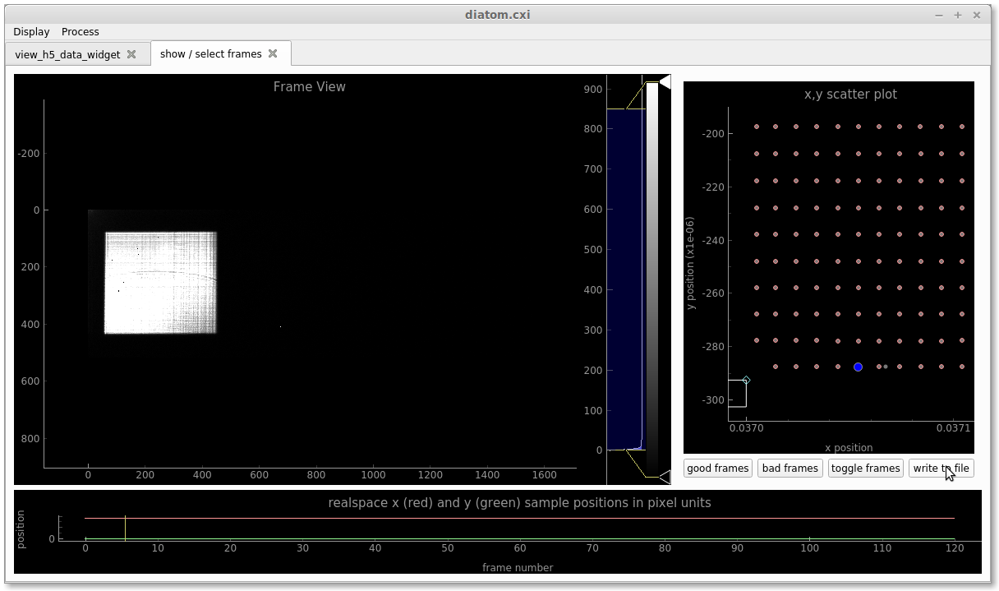
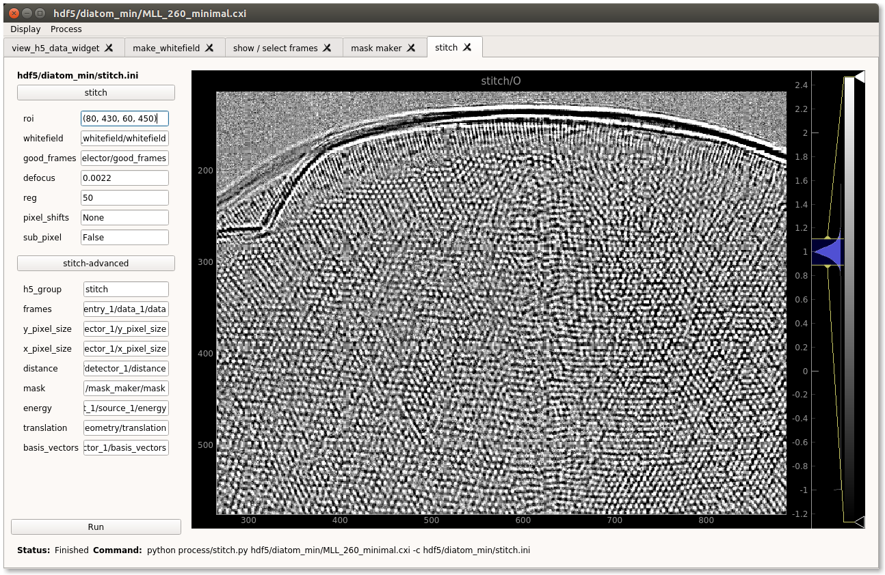
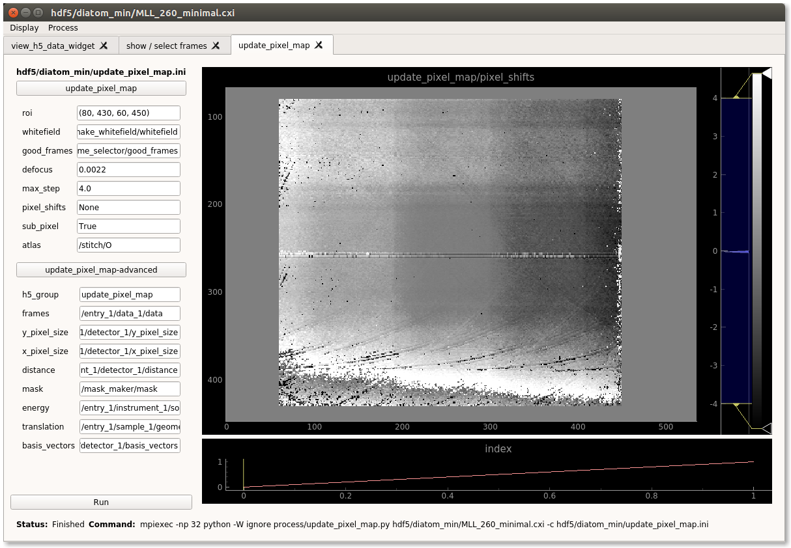

Diatom example
**************

.. contents:: Table of Contents

Workflow:
    install --> select diffraction frames --> make whitefield --> make mask --> make object map --> update pixel shift map (and obj.) --> update translations (and obj.)

Then one can cylce through:
    update pixel shift map --> make object map --> update translations --> make object map

until satisfied.

Install
=======
.. code-block:: bash
    
    ssh -X max-cfel
    git clone https://github.com/andyofmelbourne/speckle-tracking.git
    cd speckle-tracking
    mkdir -p hdf5/diatom
    cp /gpfs/cfel/cxi/scratch/user/amorgan/2018/speckle-data/MLL_260/MLL_260_minimal.cxi hdf5/diatom/
    source /gpfs/cfel/cxi/common/cfelsoft-rh7/setup.sh
    module load cfel-python3/latest

Now compile the cython code:

.. code-block:: bash
    
    cd utils 
    python setup.py build_ext --inplace
    cd ..

and run the gui:

.. code-block:: bash
    
    python gui/speckle-gui.py hdf5/diatom/MLL_260_minimal.cxi

Now you should see a confusing error about some widget not having 'R'. This is because the gui doesn't know where to find the sample translations, which is at: *MLL_260_minimal.cxi:/entry_1/sample_1/geometry/translation*. When you ran the last command above, it automatically created a file called *hdf5/diatom/speckle-gui.ini*, which is copied from the template in *gui/speckle-gui.ini*. Anyway we must edit this new file and change the line from:

.. code-block:: bash
    
    [hdf5/diatom/speckle-gui.ini]
    translation_paths = ['/pos_refine/translation', '/entry_1/sample_3/geometry/translation']

To: 

.. code-block:: bash
    
    [hdf5/diatom/speckle-gui.ini]
    translation_paths = ['/pos_refine/translation', '/entry_1/sample_3/geometry/translation', '/entry_1/sample_1/geometry/translation']

Now rerun the last command, and you should be looking at a window with two tabs. Click on the tab *show / select frames*, drag the verical yellow line to the right, then adjust the colour scale and you should see diffraction data. 

Select frames
=============
Now there are bad frames we need to get rid of. Click with the mouse on red dot representing the first frame (you can tell which is which by dragging the yellow line and observing the blue dot on the frame selector) you should see that it turns grey. Not so obvious is that the entire right hand column is also bad (the translations are badly encoded). Drag the rectangle over these frames and click *bad frames* then click *write to file*. You should then be looking at this:

Now select the *view_h5_data_widget* widget and click update. At the bottom a new entry should appear called: *frame_selector/good_frames* which is just a list of good diffraction data to use.

Make whitefield
===============
Now let's make a whitefield. Click *Process/make_whitefield*, set *sigma_t* to None (mouse hover over text for a tooltip). Then click *Run* when finished an image should appear, adjust the colour scale and you should see a white square. 

Now you can close the *show / select frames* tab, then click *Display/show / select frames* to open it again. Now each of the diffraction patterns should be divided by the whitefield.  

Make mask
=========
Click *Process/mask maker*, then click the button *next frame* and adjust colour scale. Mask bad pixels, (click *next frame* to see if any hot pixels light up), then click *save mask*.

Stitch (make an object map)
===========================
Click *Process/stitch*, then set the parameters to:

.. code-block:: bash

    [stitch]
    roi = (80, 430, 60, 450)
    whitefield = /make_whitefield/whitefield
    good_frames = /frame_selector/good_frames
    defocus = 0.0022
    reg = 50
    
    [stitch-advanced]
    mask = /mask_maker/mask
    translation = /entry_1/sample_1/geometry/translation

Click *Run* and you should see: 

Update pixel shift map
======================
Click *Process/update_pixel_map*, then set the parameters to:

.. code-block:: bash

    [update_pixel_map]
    roi = (80, 430, 60, 450)
    whitefield = /make_whitefield/whitefield
    good_frames = /frame_selector/good_frames
    defocus = 0.0022
    max_step = 4.0 
    pixel_shifts = None
    sub_pixel = True 
    atlas = /stitch/O 

    [update_pixel_map-advanced]
    mask = /mask_maker/mask
    translation = /entry_1/sample_1/geometry/translation
    

Click *Run* and you should see: 

This is the x-shifts and y-shifts due to the lens aberrations. Now go back to *Process/stitch* change: 

.. code-block:: bash

    [stitch]
    reg = None
    pixel_shifts = /update_pixel_map/pixel_shifts
    sub_pixel = True

Click *Run* and you should see an improved map of the object.

Update translations
===================
Click *Process/pos_refine*, then set the parameters to:

.. code-block:: bash

    [pos_refine]
    roi = (80, 430, 60, 450)
    whitefield = /make_whitefield/whitefield
    good_frames = /frame_selector/good_frames
    defocus = 0.0022
    reg = None 
    atlas_smooth = 0 
    max_step = 10.0 
    max_iters = 10 
    pixel_shifts = /update_pixel_map/pixel_shifts
    sub_pixel = True 
    atlas = /stitch/O 

    [pos_refine-advanced]
    mask = /mask_maker/mask
    translation = /entry_1/sample_1/geometry/translation

Click *Run* and the new positions will be written to */pos_refine/translation*. Now go back to *Process/stitch* change: 

.. code-block:: bash

    [stitch-advanced]
    translation = /pos_refine/translation

Click *Run* and you should see a (very slightly) improved map of the object.

Update pixel shift map (agian)
==============================
Now update the pixel shift map again, but be sure to include the new translations. Click *Process/update_pixel_map*, then set the parameters to:

.. code-block:: bash

    [update_pixel_map]
    pixel_shifts = /update_pixel_map/pixel_shifts
    
    [update_pixel_map-advanced]
    translation = /pos_refine/translation

