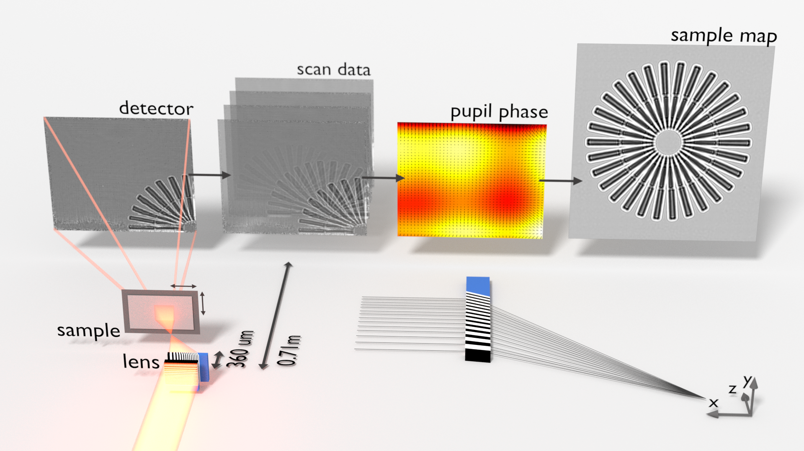

A wavefront sensing application for x-ray imaging experiments based on the speckle tracking approach. 

If your experiment looks something like this:

then you have come to the right place.

Installation (Linux)
====================
The easiest way to install speckle_tracking is through `Miniconda <https://docs.conda.io/en/latest/miniconda.html>`_::

    git clone https://github.com/andyofmelbourne/speckle-tracking.git
    cd speckle-tracking
    conda create --file requirements.txt -c conda-forge -n test python=3
    conda activate test
    pip install -e .

Note on pip
    Make sure that pip is the miniconda one, and not the system version, e.g.::

        which pip
        >> /home/username/programs/miniconda3/envs/test/bin/pip

    this will ensure that the dependencies are installed into the current conda environment and prevent poluting the system python envoriment.

Note also
    There is nothing to "install" for speckle-tracking. The point of the above procedure is to install the dependecies, add the module to the PYTHONPATH and to add the scripts to the PATH.

Documentation
=============
https://speckle-tracking.readthedocs.io

Getting Started
===============
Start with the `Diatom tutorial <https://speckle-tracking.readthedocs.io/en/latest/CFEL_diatom_tutorial.html>`_, then do the `Simens star tutorial <https://speckle-tracking.readthedocs.io/en/latest/siemens_star.html>`_

Citation
========
`Morgan, A. J., Murray, K. T., Quiney, H. M., Bajt, S. & Chapman, H. N. (2020). J. Appl. Cryst. 53. <https://doi.org/10.1107/S1600576720011991>`_

