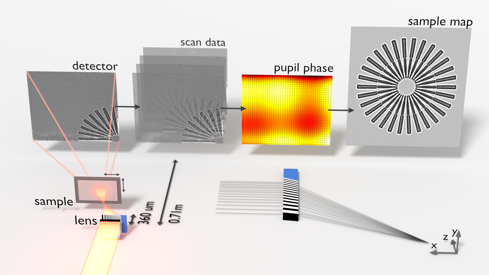

Projection Images
=================
Here we describe a projection image, formed by shining potentially aberrated focused monochromatic light through a thin sample onto a detector far from the focus, as a distorted view of a magnified image one would have seen with plane wave illumination and the detector placed close to the sample. 

OK, that's a lot of words. But basically we are drawing the connection between the images formed by:

- divergent aberrated light --> sample --> detector
- and, 
- plane wave --> sample --> detector

so that we can determine the lens aberrations and form an un-distorted view of the sample projection image. 

Magnified Aberrated Projection Images
-------------------------------------
Say that the light wavefronts at the plane of the sample and detector are given by:

.. math::
    
    \begin{align}
    P(\mathbf{x}, z_1) &= a(\mathbf{x}) e^{i\phi(\mathbf{x})} && \text{sample plane} \\
    P(\mathbf{x}, z_2) &= A(\mathbf{x}) e^{i\Phi(\mathbf{x})} && \text{detector plane}
    \end{align}

where :math:`z_1` and :math:`z_2` are the focus to sample and sample to detector distances respectively, :math:`\phi` and :math:`\Phi` are the respective wavefront phases and :math:`a` and :math:`A` are the wavefront amplitudes, we'll call :math:`A` the aperture function and :math:`P(x, z_2)` the pupil function.

Now we put a thin sample, with a transmission function :math:`T`, into the beam of light a distance :math:`z_1` from the focal point. Then the image formed on the detector is given by the mod square of the Fresnel integral:

.. math::
    
    \begin{align}
    I^{z_1}_\phi(\mathbf{x}, z_2) &= \big| \left[ T(\mathbf{x})  P(\mathbf{x}, z_1)\right] \otimes e^{i\pi \frac{\mathbf{x}^2}{\lambda z_2}} \big|^2
    \end{align}

On the other hand, if we had un-abberrated plane wave illumination shinning through the sample onto a detector placed at a distance :math:`z_\text{eff}` from the sample then we would see 

.. math::
    
    \begin{align}
    I^{\infty}_0(\mathbf{x}, z_\text{eff}) &= \big| T(\mathbf{x}) \otimes e^{i\pi \frac{\mathbf{x}^2}{\lambda z_\text{eff}}} \big|^2 \\
    \end{align}

It turns out that :math:`I^{z_1}_\phi` is, more or less, a magnified view of :math:`I^{\infty}_0` with geometric distortions caused by the phase aberrations:

.. math::
    
    \begin{align}
    I^{z_1}_\phi(\mathbf{x}, z_2) &\approx 
    A^{2}(\mathbf{x}) I^{\infty}_0(\mathbf{x} 
    - \frac{\lambda z_\text{eff}}{2\pi} \nabla\phi(\mathbf{x}), z_2) \quad \text{and} \\
    I^{\infty}_0(\mathbf{x}, z_\text{eff}) &\approx 
    A^{-2}(\mathbf{x}) I^{z_1}_\phi(\mathbf{x} 
    - \frac{\lambda z^-_\text{eff}}{2\pi} \nabla\Phi(\mathbf{x}), z_2) \quad \text{where} \\
    M = \frac{z_1 + z_2}{z_1} \quad \text{and} 
    \quad z_\text{eff} &= \frac{z_2}{1 + \frac{\lambda z_2}{2 \pi} \langle\nabla^2 \phi\rangle_{\mathbf{x}}} \quad \text{and} 
    \quad z^-_\text{eff} = \frac{-z_2}{1 + \frac{\lambda (-z_2)}{2 \pi} \langle\nabla^2 \Phi\rangle_{\mathbf{x}}}
    \end{align}

Fresnel Scaling Theorem
-----------------------
The above equation is a more general form of the Fresnel scaling theorem, which states that: 
    The projected image of a thin scattering object from a point source of monochromatic light is equivalent to a magnified defocused image of the object formed by moving the point source of light infinitely far away.

and we can see that this is indeed the case if we set :math:`\Phi = \pi \mathbf{x}^2 / \lambda (z_1+z_2)` and :math:`A=M^{-2}` in the above equation. So we have: 

.. math::
    
    \begin{align}
    \Phi(\mathbf{x})          &= \frac{\pi \mathbf{x}^2}{\lambda (z_1 + z_2)} \quad
    \nabla \Phi(\mathbf{x})   = \frac{2\pi \mathbf{x}}{\lambda (z_1 + z_2)}  \quad
    \nabla^2 \Phi(\mathbf{x}) = \frac{2\pi}{\lambda (z_1 + z_2)}
    \end{align}

and:

.. math::
    
    \begin{align}
    z^-_\text{eff} &= \frac{z_2}{\frac{\lambda z_2}{2 \pi} \langle\nabla^2 \Phi\rangle_{\mathbf{x}}-1}  
    = \frac{z_2}{\frac{\lambda z_2}{2 \pi} \frac{2\pi}{\lambda (z_1 + z_2)} -1} 
    = -\frac{z_2}{z_1}(z_1+z_2) \\
    \end{align}

and:

.. math::
    
    \begin{align}
    \mathbf{x} - \frac{\lambda z_\text{eff}}{2\pi} \nabla\Phi(\mathbf{x}) &= \mathbf{x} + \frac{\lambda }{2\pi}\frac{z_2}{z_1}(z_1+z_2) \frac{2\pi \mathbf{x}}{\lambda (z_1 + z_2)}
    = \mathbf{x}\frac{z_1 + z_2}{z_1} 
    = M \mathbf{x} \\
    \end{align}

and finally:

.. math::

    \begin{align}
    I^{\infty}_0(\mathbf{x}, z_\text{eff}) &\approx M^{-2} I^{z_1}_\Phi(M\mathbf{x}, z_2) \quad \text{as required}
    \end{align}

