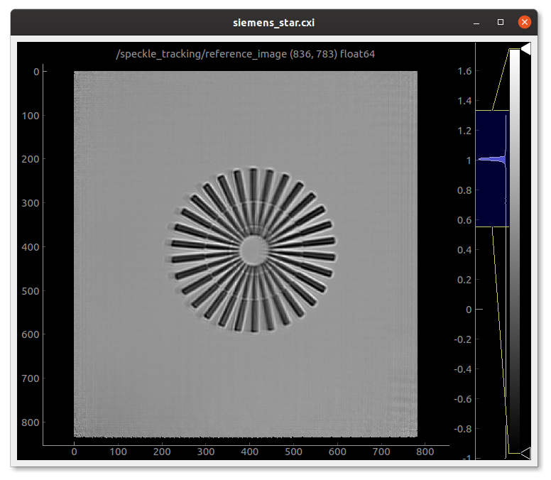

.. _siemens_star:

Siemens Star
============

First get the siemens_star cxi file (link to come). 

For a more detailed introduction to the speckle-tracking interface, start with the :ref:`diatom` tutorial. 

The Input CXI File
------------------
The file has the following structure::

     └─ $  h5ls -r siemens_star.cxi 
    /                        Group
    /entry_1                 Group
    /entry_1/data_1          Group
    /entry_1/data_1/data     Dataset {400, 480, 438}
    /entry_1/instrument_1    Group
    /entry_1/instrument_1/detector_1 Group
    /entry_1/instrument_1/detector_1/basis_vectors Dataset {400, 2, 3}
    /entry_1/instrument_1/detector_1/distance Dataset {SCALAR}
    /entry_1/instrument_1/detector_1/mask Dataset {480, 438}
    /entry_1/instrument_1/detector_1/x_pixel_size Dataset {SCALAR}
    /entry_1/instrument_1/detector_1/y_pixel_size Dataset {SCALAR}
    /entry_1/instrument_1/source_1 Group
    /entry_1/instrument_1/source_1/energy Dataset {SCALAR}
    /entry_1/instrument_1/source_1/wavelength Dataset {SCALAR}
    /entry_1/sample_1        Group
    /entry_1/sample_1/geometry Group
    /entry_1/sample_1/geometry/translation Dataset {400, 3}

This is the minimal amount of information that the input cxi file can have, see :ref:`cxi-file`. So, as we can see in the :code:`entry_1/data_1/data` the dataset consists of 400 frames, where each frame is an image of 480x438 pixels.

For this tutorial, we will show how to reconstruct the wavefield and sample reference image using the `Python Interface`_ and the `Command-line Interface`_. If you are using the GUI interface, then follow the `Command-line Interface`_ with the corresponding widget and input values.

Python Interface
----------------

Make the mask
    First let's import speckle tracking and things, then call the :py:func:`~speckle_tracking.make_mask` function with default settings to create a binary True/False (good/bad) pixel map for the detector. Then we are going to write this back into the file::

        import speckle_tracking as st
        import h5py
        import numpy
        
        # extract data
        f = h5py.File('siemens_star.cxi', 'r')

        data  = f['/entry_1/data_1/data'][()].astype(np.float32)
        basis = f['/entry_1/instrument_1/detector_1/basis_vectors'][()]
        z     = f['/entry_1/instrument_1/detector_1/distance'][()]
        x_pixel_size = f['/entry_1/instrument_1/detector_1/x_pixel_size'][()]
        y_pixel_size = f['/entry_1/instrument_1/detector_1/y_pixel_size'][()]
        wav          = f['/entry_1/instrument_1/source_1/wavelength'][()]
        translations = f['/entry_1/sample_1/geometry/translation'][()]
        
        f.close()
        
        mask  = st.make_mask(data)
        

Generate the Whitefield
    Now we make the "whitefield" which is what I call the image formed on the detector when there is no sample in place. You might already have this from a separate measurement, but usually it's better to estimate it directly from the scan data which we do by calling :py:func:`~speckle_tracking.make_whitefield`::

        W = st.make_whitefield(data, mask)
        
Define the ROI 
    Often, the region of the detector with useful diffraction is small compared to the full detector area. So defining the ROI (Region Of Interest) speeds things up, do this manually or by using a script that tries to guess this region :py:func:`~speckle_tracking.guess_roi`::
        
        roi = st.guess_roi(W)
        
        # apply ROI
        shape = data.shape
        data  = np.ascontiguousarray(data[:, roi[0]:roi[1], roi[2]:roi[3]])
        W     = W[roi[0]:roi[1], roi[2]:roi[3]]
        mask  = mask[roi[0]:roi[1], roi[2]:roi[3]]

Determine the defocus
    Now let's refine the focus to sample distance :py:func:`~speckle_tracking.fit_thon_rings`:: 
        
         defocus, res = st.fit_thon_rings(
                      data,
                      x_pixel_size, y_pixel_size,
                      z, wav, mask, W, None)
         defocus_ss = res['defocus_ss']
         defocus_fs = res['defocus_fs']

    defocus_ss and defocus_fs are the distances between the beam waist along the 
    slow and fast scan axes of the detector respectively. The average of these is
    the defocus distance.
        
Generate the pixel mapping
    Now let us estimate the geometric distortions of each image from the defocus 
    values (defocus_ss and defocus_fs)
    using :py:func:`~speckle_tracking.generate_pixel_map`::
        
         pixel_map, pixel_translations, res = st.generate_pixel_map(
                 W.shape, 
                 translations, 
                 basis,
                 x_pixel_size, 
                 y_pixel_size, 
                 z, 
                 defocus_fs, 
                 defocus_ss,
                 None, None, True)

         dss = res['dss']
         dfs = res['dfs']

    where these last values (dss and dfs) are the linear dimensions of the demagnified pixels
    along the detector slow and fast scan axes, which may be different from the lab frame
    x and y axes.

Form the reference image
    Now we calculate the projection image of the sample using our initial estimate 
    of the pixel mapping, via :py:func:`~speckle_tracking.make_reference`,
    which will be somewhat blurry because of the remaining lens aberrations::
        
         O, n0, m0 = st.make_reference(
                        data, 
                        mask, 
                        W, 
                        pixel_translations,
                        pixel_map,
                        subpixel=True)

Refinement
    Now we have the pixel map and the object map, we can refine our estimate for all parameters 
    in the system. Here is the full working example with a basic refinement loop::
   
         import speckle_tracking as st
         import h5py
         import numpy as np

         #---------------------------
         # Read data
         #---------------------------
         f = h5py.File('siemens_star.cxi', 'r')

         data  = f['/entry_1/data_1/data'][()].astype(np.float32)
         basis = f['/entry_1/instrument_1/detector_1/basis_vectors'][()]
         z     = f['/entry_1/instrument_1/detector_1/distance'][()]
         x_pixel_size = f['/entry_1/instrument_1/detector_1/x_pixel_size'][()]
         y_pixel_size = f['/entry_1/instrument_1/detector_1/y_pixel_size'][()]
         wav          = f['/entry_1/instrument_1/source_1/wavelength'][()]
         translations = f['/entry_1/sample_1/geometry/translation'][()]

         f.close()

         #---------------------------
         # Intialise
         #---------------------------
          
         # auto make the mask
         mask  = st.make_mask(data)

         # auto make the whitefield
         W = st.make_whitefield(data, mask)

         # auto make the region of interest
         roi = st.guess_roi(W)

         # apply ROI
         shape = data.shape
         data = np.ascontiguousarray(data[:, roi[0]:roi[1], roi[2]:roi[3]])
         W    = W[roi[0]:roi[1], roi[2]:roi[3]]
         mask = mask[roi[0]:roi[1], roi[2]:roi[3]]
          
         # estimate defocus 
         defocus, res = st.fit_thon_rings(
                      data,
                      x_pixel_size, y_pixel_size,
                      z, wav, mask, W, None)
         defocus_ss = res['defocus_ss']
         defocus_fs = res['defocus_fs']

         # generate pixel map
         pixel_map, pixel_translations, res = st.generate_pixel_map(
                 W.shape, 
                 translations, 
                 basis,
                 x_pixel_size, 
                 y_pixel_size, 
                 z, 
                 defocus_fs, 
                 defocus_ss,
                 None, None, True)

         dss = res['dss']
         dfs = res['dfs']
                           
         # make reference image
         O, n0, m0 = st.make_reference(
                        data, 
                        mask, 
                        W, 
                        pixel_translations,
                        pixel_map,
                        subpixel=True)

         #---------------------------
         # Main loop
         #---------------------------

         errs = []
         for i in range(10):
             
             # calculate errors
             *error, flux_corr = st.calc_error(
                           data, mask, W, 
                           pixel_translations, 
                           O, pixel_map, n0, m0, 
                           subpixel=True)
             
             # store total error
             errs.append(error[0])
             
             # update pixel map
             pixel_map, res = st.update_pixel_map(
                         data, mask, W, O, pixel_map, 
                         n0, m0, pixel_translations, 
                         search_window = [30, 30],
                         clip = [-40, 40],
                         fill_bad_pix = True, 
                         integrate = True, 
                         quadratic_refinement = True)
             
             # make reference image
             O, n0, m0  = st.make_object_map(data, mask, W, pixel_translations, pixel_map, subpixel=True)
             
             # update translations
             pixel_translations, res = st.update_translations(data, mask, W, O, pixel_map, n0, m0, pixel_translations)

             print('\nerrors')
             for j in range(i+1):
                 print('error: {} {:.2e}'.format(j, errs[j]))

         #---------------------------
         # Additional analysis
         #---------------------------

         # calcuate phase profile
         phase, angles, res = st.calculate_phase(pixel_map, W, wav, z, x_pixel_size, y_pixel_size, dss, dfs)

         # use phase to calculate focus profile
         profile_ss, profile_fs, dx, dy, dz = st.focus_profile(phase, W, z, wav, x_pixel_size, y_pixel_size, zs=[-1e-4, 1e-4, 1000], Nint=4)

         # calculate the sample thickness profile
         # for gold from http://henke.lbl.gov/optical_constants/getdb2.html
         delta, beta = 1.11737199E-05, 1.38204348E-06

         # cut 100 pixels from each edge 
         ref_roi = [100, O.shape[0]-100, 100, O.shape[1]-100]

         sample_thickness_pag, sample_thickness_ctf = st.calculate_sample_thickness(
                     delta, beta, z, 
                     defocus, 
                     wav, 
                     dss, dfs, 
                     O, ref_roi,
                     set_median_to_zero = True)
               

         #---------------------------
         # Write results
         #---------------------------
         # 'un-roi' arrays to put them on the original pixel grid
         pixel_map_out = np.zeros((2,) + shape[1:], dtype = pixel_map.dtype)
         pixel_map_out[:, roi[0]:roi[1], roi[2]:roi[3]] = pixel_map

         angles_out = np.zeros((2,) + shape[1:], dtype = angles.dtype)
         angles_out[:, roi[0]:roi[1], roi[2]:roi[3]] = angles

         phase_out = np.zeros(shape[1:], dtype=phase.dtype)
         phase_out[roi[0]:roi[1], roi[2]:roi[3]] = phase

         st.write_h5({
             'reference_image': O, 
             'n0': n0, 'm0': m0, 
             'dss': dss, 
             'dfs': dfs, 
             'defocus': defocus, 
             'defocus_ss': defocus_ss, 
             'defocus_fs': defocus_fs, 
             'pixel_map': pixel_map_out, 
             'pixel_translations': pixel_translations,
             'propagation_profile_ss': profile_ss, 
             'propagation_profile_fs': profile_fs, 
             'propagation_profile_voxel_size': np.array([dx, dy, dz]),
             'phase' : phase_out,
             'angles' : angles_out,
             'sample_thickness' : np.array([sample_thickness_ctf, sample_thickness_pag])
             }, og='speckle_tracking/')

..
   .. raw:: html

       

Command-line Interface
----------------------

Initialisation 
##############

:: 
    
    # build the pixel mask (with default settings)
    make_mask.py siemens_star.cxi

    # build the white-field array (with default settings)
    make_whitefield.py siemens_star.cxi
    
    # estimate the significant region of interest 
    guess_roi.py siemens_star.cxi

    # estimate the defocus values by ``Thon ring'' fitting
    fit_thon_rings.py siemens_star.cxi

    # check the result of the above procedure
    hdf_display.py siemens_star.cxi/speckle_tracking/thon_display

fit_thon_rings.py has just written three defocus values into the cxi file at the default locations::

    /speckle_tracking/defocus_fs 3.68e-4
    /speckle_tracking/defocus_ss 3.94e-4
    /speckle_tracking/defocus    3.81e-4
    
The first value, "defocus_fs" is the distance between the beam waist and the sample along the "fast scan" axis of the detector, the second, "defocus_ss" along the "slow scan" axis and the final value, "defocus" is the average of the two previous values. By default, :py:func:`~speckle_tracking.generate_pixel_map` just takes the average value. But the initial pixel map will be much better if we account for this astigmatism by providing the two defocus values. 

First just run :py:func:`~speckle_tracking.generate_pixel_map` with the default configuration. This will copy the file generate_pixel_map.ini into the current directory. Then change the first two parameters, so that he file appears thusly (I have removed the comments)::

   [generate_pixel_map]
   defocus_fs = /speckle_tracking/defocus_fs 
   defocus_ss = /speckle_tracking/defocus_fs 
   dfs        = None 
   dss        = None 
   roi        = /speckle_tracking/roi 
   mask       = /speckle_tracking/mask 

   [generate_pixel_map-advanced]
   h5_group     = speckle_tracking ;str, name of h5 group to write to
   basis        = /entry_1/instrument_1/detector_1/basis_vectors
   z            = /entry_1/instrument_1/detector_1/distance
   x_pixel_size = /entry_1/instrument_1/detector_1/x_pixel_size
   y_pixel_size = /entry_1/instrument_1/detector_1/y_pixel_size
   translations = /entry_1/sample_1/geometry/translation

Now rerun the command to produce the initial estimate for the pixel map, this will automatically use the parameters in the configuration file stored in the same directory::

    # generate the pixel mapping
    generate_pixel_map.py siemens_star.cxi
    
    # build the reference image
    make_reference.py siemens_star.cxi
     
    # check that the reference image is vaguely sensible
    hdf_display.py siemens_star.cxi/speckle_tracking/reference_image

After executing the last line and adjusting the display, you should see a vaguely sensible image of a siemens star:

Main loop 
#########
Now we will iterate through the commands :py:func:`~speckle_tracking.calc_error`, :py:func:`~speckle_tracking.update_pixel_map`, :py:func:`~speckle_tracking.make_reference` and :py:func:`~speckle_tracking.update_translations` until convergence::

    # calculate the figures of merit
    calc_error.py siemens_star.cxi

    # see below for the parameters
    update_pixel_map.py siemens_star.cxi
    
    # see below for the parameters
    update_translations.py siemens_star.cxi

    # update the reference image 
    make_reference.py siemens_star.cxi

The initial error (error_total) is 5.1e7, 2.0e7, 1.8e7
