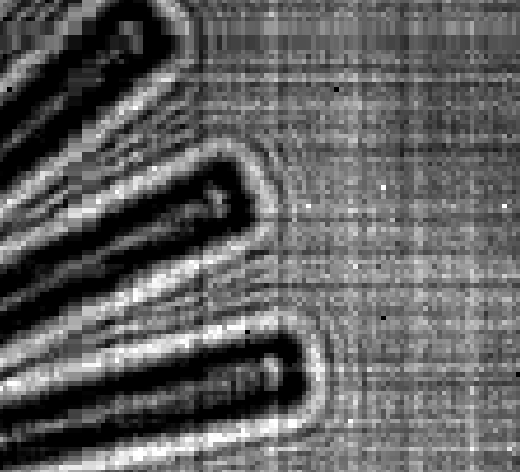

Thon Rings
==========
If you look at the defocused image of a thin sample with phase contrast, then you will see Fresnel fringes around the edges. See, for example, this image from the :ref:`siemens_star` tutorial:

These fringes arise from the effective contrast transfer function, or optical transfer function, of the imaging system:

.. math::
    
    \begin{align}
       I(\mathbf{x}) &= \big| T(\mathbf{x}) \otimes \mathcal{F}^{-1}[\text{TF}](\mathbf{x}) \big|^2
    \end{align}

where I is the image on a detector, T the transmission function of an object and TF is the transfer function of the imaging system. 

For example, take free-space propagation:

.. math::
    
    \begin{align}
       I(\mathbf{x}) &= \big| T(\mathbf{x}) \otimes \mathcal{F}^{-1}[e^{-i\pi\lambda z_2\mathbf{q}^2}] \big|^2
    \end{align}

this roughly corresponds to the situation in the image above. Now if we take the Fourier transform of this image (see the image below) then we can often observe concentric rings modulating a complicated pattern. These are the Thon rings and they can be used to roughly estimate the TF, for example this might give us the propagation distance :math:`z_2` in the above example.

Thin weakly scattering object
-----------------------------
For a thin weakly scattering object we can approximate:

.. math::
    
    \begin{align}
    T(\mathbf{x})  &\approx e^{-i\frac{2\pi}{\lambda} \int dz n(\mathbf{x})} &&\text{projection approximation (thin sample)} \\
    &&& \text{with refractive index } n(\mathbf{x}) = \delta_\lambda(\mathbf{x}) -i\beta_\lambda(\mathbf{x}) \\
    &\approx e^{-\frac{2\pi}{\lambda} t(\mathbf{x}) (i\delta_\lambda + \beta_\lambda)} &&\text{single material of projected thickness } t(\mathbf{x}) \\
    &\approx 1 - \frac{2\pi}{\lambda} t(\mathbf{x}) (\beta_\lambda + i \delta_\lambda) &&\text{weakly scattering}
    \end{align}

Now we can approximate the Fourier transform of the image as:

.. math::
    
    \begin{align}
       \hat{I}(\mathbf{q}) &\approx \frac{2\pi}{\lambda}\hat{t}(q)\left[ 
       i\delta_\lambda \left( \text{TF}^*(-\mathbf{q}) - \text{TF}(\mathbf{q}) \right)
       -\beta_\lambda \left( \text{TF}^*(-\mathbf{q}) + \text{TF}(\mathbf{q}) \right)
       \right]  \quad \text{for } \mathbf{q} \neq 0
    \end{align}

Pure phase contrast image
^^^^^^^^^^^^^^^^^^^^^^^^^
Let us consider the case of free-space propagation, and a pure phase contrast image (:math:`\beta_\lambda = 0`):

.. math::
    
    \begin{align}
       \text{TF}(\mathbf{q}) &= e^{-i\pi\lambda z_2 \mathbf{q}^2} && \text{TF}^*(-\mathbf{q}) - \text{TF}(\mathbf{q}) 
       = 2i\sin(\pi\lambda z_2 \mathbf{q}^2) \\
       \hat{I}(\mathbf{q}) &= -\frac{4\pi}{\lambda} \delta_\lambda \hat{t}(\mathbf{q}) \sin(\pi\lambda z_2 \mathbf{q}^2)
       && \text{for } \mathbf{q} \neq 0
    \end{align}

.. image:: images/siemens_thon.png
   :width: 300

The above image was actually made from:

.. math::
    
    \begin{align}
    \text{image}(q) &= \sum_n \big|\mathcal{F}[M(r) e^{-r^2 / 2 \sigma^2} I_n(r) / W(r) ](q) \big|^2
    \end{align}

where :math:`n` is the image number, :math:`M(r)` is the mask, :math:`W(r)` is the whitefield, and the Gaussian is applied to avoid Fourier aliasing artefacts. The image was then taken to the power of 0.1 to enhance the contrast.

Projection images
-----------------
For projection imaging we have the approximation:

.. math::
    
    \begin{align}
    I^{z_1}_\phi(\mathbf{x}, z_2) &\approx \big|T(\mathbf{x}) \otimes e^{\frac{i \pi}{\lambda z^\text{eff}_x} \left( x - \frac{\lambda z^\text{eff}_x}{2\pi} \phi_{,x}(\mathbf{x})\right)^2
                                                                 \times  \frac{i \pi}{\lambda z^\text{eff}_y} \left( y - \frac{\lambda z^\text{eff}_y}{2\pi} \phi_{,y}(\mathbf{x})\right)^2} \big|^2
    \end{align}

Let make a Taylor series expansion of the phase up to second order in :math:`x` and :math:`y`:

.. math::
    
    \begin{align}
    \phi(\mathbf{x}) &\approx \phi_{00} + \phi_{10}x + \phi_{01}y + \frac{1}{2}\phi_{20}x^2 + \frac{1}{2}\phi_{02}y^2  \\
    \text{for } \phi_{nm} &= \frac{\partial^{n+m} \phi(\mathbf{x})}{\partial x^n \partial y^2}\biggr\rvert_{\mathbf{x}=0}
    \end{align}

where zeroth, first and second order terms correspond to piston, tilt and defocus aberrations. We have also set :math:`\phi_{11}=0` for simplicity. Now let's expand the exponential term:

.. math::
    
    \begin{align}
    \frac{i \pi}{\lambda z^\text{eff}_x} \left(x - \frac{\lambda z^\text{eff}_x}{2\pi} \phi_{,x}(\mathbf{x})\right)^2 
    &= \frac{i \pi}{\lambda z^\text{eff}_x} \left(x - \frac{\lambda z^\text{eff}_x}{2\pi} (\phi_{10} + \phi_{20}x) \right)^2 \\
    &= \frac{i \lambda z^\text{eff}_x}{4\pi} \left( \phi_{10} + (\phi_{20} -  \frac{2\pi}{\lambda z_x^\text{eff}})x\right)^2\\
    &= \frac{i \lambda z^\text{eff}_x}{4\pi} \left( \phi_{10} + \frac{2\pi}{\lambda z_2}x\right)^2 
     = \frac{i \pi z^\text{eff}_x}{\lambda z_2^2} \left( x + \frac{\lambda z_2}{2\pi}\phi_{10} \right)^2 \quad \text{where}\\
    z^\text{eff}_x = \frac{z_2}{1+\frac{\lambda z_2}{2\pi}\phi_{20}} \quad &\text{and} \quad 
    \phi_{20} -  \frac{2\pi}{\lambda z_x^\text{eff}} = \phi_{20} -  \frac{2\pi}{\lambda }\left(\frac{1}{z_2}+\frac{\lambda }{2\pi}\phi_{20}\right) = \frac{2\pi}{\lambda z_2} \\
    \end{align}

Now we can take the Fourier transform and evaluate the effective transfer function of the imaging system:

.. math::
    
    \begin{align}
    \text{TF}(\mathbf{q}) &= e^{-i\pi\lambda q'^2} 
                          e^{ i \lambda z_2 (\phi_{10} q_x + \phi_{01} q_y)} \quad \text{where}\\
    M_x &= \frac{z_2}{z_x^\text{eff}}, \quad M_y = \frac{z_2}{z_y^\text{eff}} \quad \text{and} \quad q'^2 = z^\text{eff}_x (q_x/M_x)^2 + z^\text{eff}_y (q_y/M_y)^2
    \end{align}

OK, so what do our Thon rings look like?

.. math::
    
    \begin{align}
       \text{TF}^*(-\mathbf{q}) - \text{TF}(\mathbf{q}) &= 2i\sin(\pi \lambda q'^2) e^{ i \lambda z_2 (\phi_{10} q_x + \phi_{01} q_y)}\\
       \text{TF}^*(-\mathbf{q}) + \text{TF}(\mathbf{q}) &= 2\cos(\pi \lambda q'^2) e^{ i \lambda z_2 (\phi_{10} q_x + \phi_{01} q_y)}\\
    \end{align}

which yeilds:

.. math::
    
    \begin{align}
       \big| \hat{I}(\mathbf{q})\big|^2 = \frac{4\pi}{\lambda}\big| \hat{t}(\mathbf{q})\big|^2 \left(\delta_\lambda  \sin(\pi \lambda q'^2) + 
       \beta_\lambda   \cos(\pi \lambda q'^2)
       \right)
    \end{align}

Fitting
-------
One problem with trying to fit the above equation for z_1 is that we don't know t. Furthermore, :math:`\hat{t}(q)` is just as likely to be positive as it is negative. So if we average over many frames and the azimuthal angle then we may just cancel out the signal we are trying to fit. So let's take the square of each power spectrum before averaging over frame number and angle. So our new target function is:

.. math::
    
    \begin{align}
    f(q, z_1) &= \sum_n \int_0^{2\pi} \big| \hat{I}_n^{z_1}(q_x, q_y, z_D-z_1)\big|^2 d\theta_q \\
    &=  \left( \sin(\pi\lambda z_\text{eff} q'^2) - \frac{\beta_\lambda}{\delta_\lambda} \cos(\pi\lambda z_\text{eff} q'^2)\right)^2 \sum_n \int_0^{2\pi} \big| \frac{4\pi\delta_\lambda}{\lambda} \hat{t}_n(q') \big|^2 d\theta_q + b(q) \\
    &=  \left( \sin(\pi\lambda z_\text{eff} q'^2) - \frac{\beta_\lambda}{\delta_\lambda} \cos(\pi\lambda z_\text{eff} q'^2)\right)^2 \text{Env}(q) + b(q)
    \end{align}

where I have also added a q-dependent background term for safe keeping.

Background and Envelope estimation
^^^^^^^^^^^^^^^^^^^^^^^^^^^^^^^^^^
For now let us assume that :math:`\beta_\lambda=0` and make an initial estimate for :math:`z_1`. Given these assumptions we can use the fact that:

.. math::
    
    \begin{align}
    \sin^2(\pi\lambda z_\text{eff} q'^2) &= \frac{1}{2}  & \text{for } q_l &= \sqrt{ \frac{(l+1/4) z_1}{\lambda z_D(z_D-z_1)} } \\
    \end{align}

to estimate a smooth background, which can be subtracted, as well as the envelope function in the previous equation.  
We would like to ensure that :math:`b(q)>\text{Env}(q)` for all q. To that end let's set the background and envelope term to the min max value of :math:`f(q)` within a single period:

.. math::
    
    \begin{align}
    b(q_{l+1/2})          &= \text{min}\left[ f(q, z_1) \right]                && \text{for } q_{l} < q < q_{l+1} \\
    \text{Env}(q_{l+1/2}) &= \text{min}\left[ f(q, z_1)\right]  - b(q_{l+1/2}) && \text{for } q_{l} < q < q_{l+1} \\
    \end{align}

Then we can just use linear interpolation to fill out the rest of the q-values:

.. math::
    
    \begin{align}
    b(q) \approx &(q_{l+1} - q) f(q_l, z_1) + (q - q_l) f(q_{l+1}, z_1)  &&\text{for } q_{l} < q < q_{l+1}\\
    \end{align}

